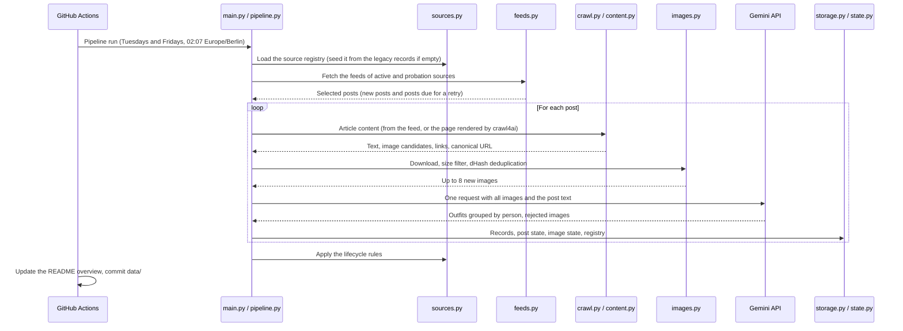

# Fashion Analytics Scraper
[](https://github.com/kleinnconrad/dataset.fashion/actions/workflows/ci.yml)

A fashion analytics pipeline that runs twice a week (Tuesdays and Fridays) in GitHub Actions. It reads the RSS feeds of personal style blogs, renders new posts with `crawl4ai`, describes the outfits in their photos with Google Gemini (`gemini-3.8-flash`) and stores one record per outfit in this repository. A weekly job finds new blogs and maintains the list of sources without manual curation.

## Table of Contents
- [Dataset Overview](#dataset-overview)
- [Pipeline Architecture](#pipeline-architecture)
- [Sources and Post Selection](#sources-and-post-selection)
- [Source Lifecycle](#source-lifecycle)
- [Record Schema 2.0](#record-schema-20)
- [Data and State Files](#data-and-state-files)
- [Workflows](#workflows)
- [Configuration](#configuration)
- [Running Locally](#running-locally)
- [Dependency Management](#dependency-management)
- [Continuous Integration](#continuous-integration)
- [Setup](#setup)

## Dataset Overview
<!-- DATASET_OVERVIEW_START -->
**Last updated:** 2026-11-20 08:47 UTC

- **Schema 2.0 records:** 1,379 outfits from 354 posts of 48 sources, published 2026-09-11 to 2026-11-20
- **Images reused across posts:** 0
- **Legacy records (schema 1.x):** 1,457 records in 119 files (2026-06-14 to 2026-10-10); collected without deduplication and without publish dates, and not included in the tables below
- **Sources:** 44 active, 5 probation, 73 dormant, 10 broken, 55 rejected, 2 retired

**Active sources** (posts processed since admission; posts skipped as republished are not included in Posts)

| Source | Country | Posts | Posts with outfits | Skipped as republished | Last post |
|---|---|---|---|---|---|
| pumpsandpushups.com | US | 32 | 96.9% (31) | 1 | 2026-11-19 |
| russh.com | AU | 27 | 70.4% (19) | 1 | 2026-11-18 |
| fashionshouldbefun.com | US | 26 | 69.2% (18) | 0 | 2026-11-18 |
| thefashiontag.com | GB | 24 | 58.3% (14) | 0 | 2026-11-19 |
| awellstyledlife.com | US | 21 | 95.2% (20) | 1 | 2026-11-20 |
| shelbeeontheedge.com | US | 21 | 81.0% (17) | 0 | 2026-11-20 |
| loverlygrey.com | US | 19 | 100.0% (19) | 0 | 2026-11-19 |
| unefemme.net | US | 18 | 83.3% (15) | 1 | 2026-11-19 |
| thewelldressedlife.com | US | 17 | 58.8% (10) | 2 | 2026-11-19 |
| caphillstyle.com | US | 16 | 50.0% (8) | 13 | 2026-11-19 |
| thecurvyfashionista.com | US | 14 | 100.0% (14) | 6 | 2026-11-19 |
| reneeruin.com | AU | 13 | 100.0% (13) | 0 | 2026-10-15 |
| mummabstylish.com | GB | 12 | 100.0% (12) | 0 | 2026-11-19 |
| permanentstyle.com | GB | 12 | 91.7% (11) | 0 | 2026-11-18 |
| midlifechic.com | GB | 11 | 72.7% (8) | 3 | 2026-11-17 |
| style-splash.com | GB | 11 | 72.7% (8) | 0 | 2026-11-19 |
| vintagevixon.blogspot.com | GB | 11 | 100.0% (11) | 0 | 2026-11-16 |
| fashion-note.me | US | 10 | 100.0% (10) | 0 | 2026-10-06 |
| 9to5chic.com | US | 9 | 88.9% (8) | 0 | 2026-10-29 |
| nofearoffashion.com | NL | 9 | 100.0% (9) | 0 | 2026-11-14 |
| merricksart.com | US | 8 | 62.5% (5) | 0 | 2026-11-19 |
| sewliberated.com | US | 8 | 75.0% (6) | 1 | 2026-11-05 |
| marissawearsanoutfit.com | US | 7 | 100.0% (7) | 0 | 2026-11-18 |
| bluecollarredlipstick.com | US | 6 | 50.0% (3) | 0 | 2026-11-17 |
| isthismutton.com | GB | 6 | 83.3% (5) | 0 | 2026-11-17 |
| cellajane.com | US | 5 | 100.0% (5) | 0 | 2026-10-28 |
| livinginyellow.com | US | 5 | 60.0% (3) | 0 | 2026-11-19 |
| clairejustineoxox.com | GB | 4 | 100.0% (4) | 1 | 2026-11-16 |
| invitadaperfecta.es | ES | 4 | 100.0% (4) | 0 | 2026-11-18 |
| messymom.com | OM | 4 | 75.0% (3) | 0 | 2026-10-30 |
| ... 14 more | | | | | |

**Fields (schema 2.0)**

| Field | Description | Known values | Distinct values |
|---|---|---|---|
| `framing` | Widest view of the person among the images of this outfit. | 100.0% (1,379) | 4 |
| `photo_context` | Who is shown: the blogger or another private person, models in a brand campaign or catalog image, or an editorial or street-style photo. | 97.2% (1,340) | 3 |
| `gender` | Perceived gender presentation of the person. | 99.3% (1,370) | 2 |
| `age_group` | Visually estimated age bracket of the person. | 99.9% (1,377) | 3 |
| `style_category` | Primary style of the outfit. | 100.0% (1,379) | 14 |
| `style_detail` | Refinement of the style in a few words, e.g. 'Relaxed weekend minimalism'. Null if not needed. | 77.4% (1,068) | 899 |
| `aesthetic_tags` | Named aesthetics or micro-trends that the outfit clearly represents. Empty list if none. | 17.4% (240) | 15 |
| `aesthetic_other` | A clearly represented aesthetic that is not in the list, in one to three words. Null if none. | 10.2% (140) | 71 |
| `focal_garment_index` | Position (starting at 1) in the garments list of the piece that draws the eye most. Null if no piece stands out. | 92.3% (1,273) | 6 |
| `layering_complexity` | Number of visible clothing layers on the upper body, from 1 (single layer) to 5 (heavy layering). | 100.0% (1,379) | 4 |
| `overall_fit` | Overall fit of the outfit. | 99.8% (1,376) | 4 |
| `silhouette` | Overall outline of the outfit. | 94.1% (1,298) | 7 |
| `color_palette_type` | Overall color character of the outfit. | 99.7% (1,375) | 5 |
| `color_contrast_strategy` | How the colors of the outfit are combined. | 99.6% (1,373) | 6 |
| `occasion` | Most likely occasion the outfit is meant for. 'Unclear' if the images and text give no indication. | 96.7% (1,334) | 6 |
| `setting` | Setting or background of the photos. | 99.2% (1,368) | 5 |
| `season` | Season suggested by the clothing and the surroundings. 'Unclear' if they give no indication. | 75.2% (1,037) | 4 |
| `weather` | Weather visible in the photos. 'Not visible' for indoor photos and whenever sky or conditions cannot be seen. | 25.7% (355) | 3 |
| `hair_length` | Hair length of the person. | 93.8% (1,293) | 4 |
| `hair_texture` | Hair texture of the person. | 92.2% (1,272) | 4 |
| `hair_style_type` | How the hair is worn. | 94.1% (1,298) | 7 |
| `hair_color` | Hair color of the person. | 92.9% (1,281) | 7 |
| `hair_parting` | How the hair is parted. | 89.8% (1,239) | 4 |
| `hair_finish` | Styling finish of the hair. | 92.2% (1,272) | 5 |
| `makeup_style` | Makeup style of the person. | 87.5% (1,206) | 4 |
| `brand_mentions` | Brands of this outfit that are named in the post title, text, tags, image captions or link texts. Do not infer brands from appearance. Empty list if none. | 51.3% (708) | 393 |
| `price_segment` | Price segment suggested by the named brands or the text. 'Unknown' without such evidence. | 37.7% (520) | 3 |
| `record_id` | Stable id derived from the post URL, the image hashes and the position of the outfit in the post. | 100.0% (1,379) | 1,379 |
| `schema_version` | Version of the record schema. | 100.0% (1,379) | 1 |
| `model` | Gemini model that produced the record. | 100.0% (1,379) | 3 |
| `extraction_hash` | Hash of the prompt, response schema, model settings and image preprocessing. Records with the same hash were extracted under the same conditions. | 100.0% (1,379) | 8 |
| `date_scraped` | UTC date of the extraction (YYYY-MM-DD). | 100.0% (1,379) | 13 |
| `published_date` | Publish date of the post from its feed (YYYY-MM-DD). | 100.0% (1,379) | 68 |
| `source_id` | Domain of the blog, without www. | 100.0% (1,379) | 48 |
| `source_country` | ISO 3166-1 alpha-2 country of the blog. Null if unknown. | 98.7% (1,361) | 8 |
| `source_country_basis` | How the country was determined: model (Gemini with web search), domain (country-code top-level domain), feed_language (region of the RSS language tag) or unknown. | 100.0% (1,379) | 3 |
| `source_region` | Region derived from source_country. | 98.7% (1,361) | 4 |
| `source_language` | Language of the blog from its feed (ISO 639-1). | 100.0% (1,379) | 3 |
| `post_url` | URL of the post. | 100.0% (1,379) | 354 |
| `canonical_url` | Canonical URL declared by the post page. | 56.3% (776) | 180 |
| `post_title` | Title of the post. | 100.0% (1,379) | 354 |
| `post_tags` | Categories and tags of the post from its feed. | 99.3% (1,370) | 848 |
| `shopping_link_count` | Number of links to shops or affiliate networks in the post. | 100.0% (1,379) | 44 |
| `outfit_colors` | Primary colors of the clothing and footwear, in the order of the garments list. | 98.7% (1,361) | 21 |

**Garments**

| Category | Items | Outfits with this category |
|---|---|---|
| Top | 1,131 | 73.5% (1,014) |
| Bottom | 995 | 71.9% (991) |
| Dress/One-piece | 235 | 17.0% (235) |
| Outerwear | 487 | 34.4% (474) |
| Footwear | 907 | 65.8% (907) |
| Bag | 451 | 32.3% (446) |
| Headwear | 96 | 7.0% (96) |
| Eyewear | 293 | 21.2% (292) |
| Jewelry | 1,018 | 44.0% (607) |
| Belt | 178 | 12.8% (177) |
| Scarf/Neckwear | 128 | 9.3% (128) |
| Hair accessory | 25 | 1.8% (25) |
| Hosiery | 76 | 5.3% (73) |
| Other | 131 | 7.8% (107) |

Most frequent garment types: Trousers (415), Jeans (307), Earrings (282), Necklace (266), T-shirt (253), Sweater (235), Dress (230), Button-up shirt (223), Heels/Pumps (197), Bracelet (183), Belt (178), Skirt (176), Ankle boots (168), Ring (168), Sunglasses (162).
<!-- DATASET_OVERVIEW_END -->

## Pipeline Architecture


```mermaid
sequenceDiagram
    participant Action as GitHub Actions
    participant Run as main.py / pipeline.py
    participant Reg as sources.py
    participant Feeds as feeds.py
    participant Page as crawl.py / content.py
    participant Img as images.py
    participant Gemini as Gemini API
    participant Store as storage.py / state.py

    Action->>Run: Pipeline run (Tuesdays and Fridays, 02:07 Europe/Berlin)
    Run->>Reg: Load the source registry (seed it from the legacy records if empty)
    Run->>Feeds: Fetch the feeds of active and probation sources
    Feeds-->>Run: Selected posts (new posts and posts due for a retry)
    loop For each post
        Run->>Page: Article content (from the feed, or the page rendered by crawl4ai)
        Page-->>Run: Text, image candidates, links, canonical URL
        Run->>Img: Download, size filter, dHash deduplication
        Img-->>Run: Up to 8 new images
        Run->>Gemini: One request with all images and the post text
        Gemini-->>Run: Outfits grouped by person, rejected images
        Run->>Store: Records, post state, image state, registry
    end
    Run->>Reg: Apply the lifecycle rules
    Action->>Action: Update the README overview, commit data/
```

## Sources and Post Selection

- **Registry.** The blogs are listed in `data/state/sources.json`. Nothing is curated by hand: the registry is seeded once from the domains of the legacy records, extended weekly by discovery, and maintained by fixed rules (see [Source Lifecycle](#source-lifecycle)).
- **Feeds.** Each run fetches the RSS or Atom feeds of the active sources and of the sources on probation. Posts published within the last 30 days that have not been processed yet are candidates. Posts whose title or tags indicate other topics (books, recipes, podcasts, interiors, giveaways, skincare, gift guides) are skipped.
- **Selection.** At most 3 posts per source and 40 posts per run, of which at most 10 come from sources on probation. The sources take turns: in the first round each source contributes its oldest post, oldest posts first. In the second and third rounds the sources with the higher recent yield (share of the last 6 processed posts that produced an outfit) come first; a source below 50% contributes no further post, and a source with fewer than 4 processed posts ranks as 50%. A post that appears in the feeds of two sources is selected once.
- **Content.** If the feed contains the full post with images, it is used directly; otherwise `crawl4ai` renders the post page. The article element is selected from the page, so that header, sidebar, related posts, share buttons and shop widgets are left out. Generic selectors are tried first, then the post containers of the Showit and Elementor site builders; if none matches, the whole page is used.
- **Old images and republished posts.** Images uploaded more than 12 months before the publish date (WordPress upload paths) are not analyzed, because their outfits would be dated wrongly. If most dated images of an article are that old, the post is skipped as republished. If the whole page had to be used, old header and sidebar images are common, so such a post is skipped only if no other image remains.
- **Images.** At most 15 candidates per post are downloaded. The pipeline corrects the EXIF orientation, discards images with a shorter side below 400 px or a banner shape, and removes duplicates with a perceptual hash (dHash), within the post and against all images analyzed before. At most 8 images go to the model.
- **Extraction.** One Gemini request per post contains all images and the post text. The model groups the images that show the same person in the same outfit and returns one outfit per person and outfit; images without an outfit are listed with a reason. Brand names are kept only if they appear in the post's text, captions or link texts. Outfits of children and teenagers are not stored.

## Source Lifecycle

| Transition | Rule |
|---|---|
| Admission | The feed is found and has at least 2 posts in the last 60 days. Legacy sources with at least 5 legacy records start as `active`, all others on `probation`. |
| Not admitted | A site that blocks automated requests (HTTP 401 or 403) or has no feed is `rejected`. An unreachable site is `broken`. A feed with fewer than 2 posts in 60 days is `dormant`. |
| `probation` to `active` | At least 2 of the first 4 processed posts produced an outfit. |
| `probation` to `rejected` | 3 of the first 4 processed posts produced no outfit. |
| `active` to `retired` | Fewer than 25% of the last 12 processed posts produced an outfit. |
| To `dormant` | No post for more than 90 days. |
| Back from `dormant` | At least 2 posts in the last 60 days, checked weekly. The source returns to its previous status. |
| To `broken` | The feed failed on 7 consecutive pipeline runs (about three and a half weeks). It is checked weekly and returns to its previous status when the feed works again. |
| Same feed | A source whose feed is the feed of another source, for example a second domain of the same blog, is `rejected`, at admission and after every run. Of the sources already in the registry, the one on the feed's own domain is kept. |

Further rules:
- Known domains are never proposed again, so `rejected` and `retired` sources stay out.
- At most 60 sources are `active` or on `probation` at the same time, and at most 10 new sources are admitted per week.
- The country of a source comes from Gemini with Google Search where available, otherwise from a country-code domain or from the region of the feed's language tag. The field `source_country_basis` records which.

## Record Schema 2.0

Each record describes one outfit of one person in one post. The models are defined in [src/schema.py](src/schema.py); the field table in the [Dataset Overview](#dataset-overview) lists every field with its description.

- **Outfit attributes:** framing, photo context (blogger or private person, brand campaign, editorial), gender, age group, style category and aesthetic tags, overall fit, silhouette, color palette and contrast, occasion, setting, season, weather, hair and makeup.
- **Garments:** one entry per garment, shoe and accessory with type and derived category, description, primary and secondary color, pattern, material, fit, length, neckline, rise, leg shape, finish and design details.
- **Fixed vocabularies:** all attributes except the free-text details use fixed lists of values. Absence is explicit: "Not visible" for attributes of the photo, "Not applicable" for garment attributes that do not apply to the item.
- **Provenance:** record id, schema version, model, extraction hash (prompt, schema and model settings), scrape and publish dates, source domain, country and language, post URL, title and tags, and the dHash and size of each image. Image URLs are not stored.

**Legacy records.** The records collected before the switch to schema 2.0 use schema 1.x. They were taken from blog homepages without deduplication and without publish dates, and many describe the same photos repeatedly. They remain unchanged in `data/` and are reported separately in the overview.

**Model changes.** Until 2026-11-03 the records were extracted by `gemini-2.5-flash` (thinking budget 2048 tokens, temperature 0.2), which Google retires in the Gemini API on 2026-12-01. The records of 2026-11-06 were extracted by `gemini-3.5-flash-lite`, which was replaced after this one run. Later records are extracted by `gemini-3.8-flash` (thinking level `LOW`; Gemini 3 and later models ignore custom temperatures). The fields `model` and `extraction_hash` separate the records of the three models.

## Data and State Files

| Path | Content |
|---|---|
| `data/YYYY/MM/fashion_analytics_YYYY-MM-DD.json` | Records of one UTC day |
| `data/state/sources.json` | Source registry |
| `data/state/posts.json` | Processed posts with status and attempts |
| `data/state/images.json` | dHashes of all analyzed images |
| `data/state/run_log.jsonl` | One line per pipeline run or weekly maintenance run, with counters and token usage. Pipeline runs also record the posts that were due before the selection caps (`posts_due`, `sources_with_due_posts`); maintenance runs record each discovery search with its focus, candidates and admitted sources, and the beginning of the answer if it named no blog (`searches`). |

The state files have a version key and one entry per line, and they are written atomically after every post.

## Workflows

| Workflow | Schedule | Purpose |
|---|---|---|
| `daily_scraper.yml` | Tuesdays and Fridays, 02:07 Europe/Berlin | Runs the pipeline, updates the overview and commits `data/` and `README.md` |
| `source_discovery.yml` | Sundays, 12:00 UTC | Re-checks dormant and broken sources, looks up countries, discovers new blogs and commits `data/state/` |
| `email_notify.yml` | After data commits | Posts a commit comment that mentions the repository owner |
| `ci.yml` | Pull requests, pushes to `main` | Lint, tests and commit message checks |

The two data workflows share a concurrency group, so they never push at the same time, and they pull with rebase and retry before pushing. Processed posts are committed even if a later step of the run fails.

Manual runs (`workflow_dispatch`) accept a `mode`:
- `normal`: same as the scheduled run.
- `shadow`: runs on a copy of the state in a temporary folder and uploads it as an artifact; nothing is committed. Shadow runs use the same API key and quota as the scheduled runs.
- `dry-run` (`daily_scraper.yml` only): no model calls; uploads a report of the selected posts and images.

## Configuration

| Variable | Default | Purpose |
|---|---|---|
| `GEMINI_API_KEY` | none | API key for Gemini (required) |
| `GEMINI_MODEL` | `gemini-3.8-flash` | Model for extraction and discovery; stored in every record. A Gemini 3 or later model: the requests set a thinking level, which Gemini 2.5 models reject |
| `MAX_POSTS_PER_RUN` | 40 | Posts per pipeline run |
| `MAX_POSTS_PER_SOURCE` | 3 | Posts per source and run |
| `MAX_PROBATION_POSTS_PER_RUN` | 10 | Posts from sources on probation per run |
| `MAX_IMAGES_PER_POST` | 8 | Images per Gemini request |
| `MAX_GEMINI_CALLS_PER_RUN` | 50 | Gemini requests per pipeline run, including retries |
| `FEED_LOOKBACK_DAYS` | 30 | Age limit of new posts; unfinished posts are given up after this period |

Fixed thresholds, such as the lifecycle rules, are constants in the modules that use them.

## Running Locally

```bash
uv sync
uv run playwright install chromium                    # browser for crawl4ai, once
uv run python src/main.py --dry-run --max-posts 20    # no model calls, writes a report
uv run python src/main.py --max-posts 5               # processes 5 posts
uv run python src/discovery.py                        # weekly maintenance
```

Local runs write to `~/Downloads/style_dataset/` unless `--output-dir` is given; in GitHub Actions they write to `data/`. `--source DOMAIN` restricts a pipeline run to one or more sources. `scripts/try_extraction.py` runs the extraction on a fixed set of posts and writes an HTML review sheet.

## Dependency Management

This project uses [uv](https://docs.astral.sh/uv/) with a lockfile for reproducible builds.

1. **Dependencies**: `pyproject.toml` declares the direct dependencies; development tools (pytest, ruff) are in the `dev` dependency group.
2. **Lockfile**: `uv.lock` pins the complete dependency tree. After changing `pyproject.toml`, run `uv lock` and commit both files.
3. **Automated Updates**: Dependabot (`.github/dependabot.yml`) checks weekly for updates of the Python dependencies (`uv` ecosystem, updating `pyproject.toml` and `uv.lock` together) and of the GitHub Actions, each grouped into a single pull request.

## Continuous Integration

The `CI` workflow (`.github/workflows/ci.yml`) runs on every pull request and on pushes to `main`:

| Job | Checks |
|---|---|
| `Lint` | `uv.lock` matches `pyproject.toml`; `ruff check`; `actionlint` (including `shellcheck`) on the workflow files |
| `Tests` | The tests in `tests/` on Python 3.11 and 3.14. They run offline, with fakes for the web, the browser and the Gemini API, and also check that every module in `src/` and `scripts/` imports with the locked dependencies. |
| `Conventional Commits` | Every commit of a pull request follows the Conventional Commits format (pull requests only) |
| `CI passed` | Succeeds only if all jobs above succeeded or were skipped; use it as the single required status check in the branch protection of `main` |

Run the Python checks locally before pushing:
```bash
uv lock --check
uv run ruff check .
uv run pytest
```

## Setup

1. Add the repository secret `GEMINI_API_KEY` under **Settings > Secrets and variables > Actions**. For local runs, put it into a `.env` file.
2. Allow workflows to push to the repository under **Settings > Actions > General > Workflow permissions**.
3. The first pipeline run seeds the source registry from the legacy records, which takes about a minute.

Copyright (c) 2026 Conrad Kleinn. All rights reserved.
